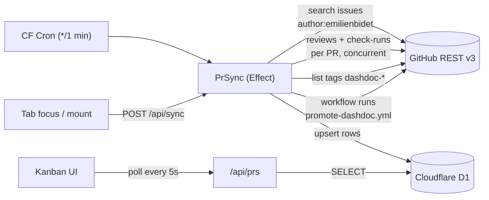

# Kanban PR tracker for dashdoc/dashdoc (user: emilienbidet)

## Progress

- ✅ Foundation — deps (`effect`, `@effect/schema`, `@effect-atom/atom-react`) installed, `wrangler.jsonc` updated (D1 binding, cron, vars, `main` → `src/worker-entry.ts`), `migrations/0001_init.sql` created. Next: user runs `wrangler d1 create dashdoc-prs` and pastes the `database_id` into `wrangler.jsonc`.
- ✅ `server/env.ts` — `Env` Context.Tag + `AppEnv` interface + `fromBindings()` guard for missing `GITHUB_TOKEN`. Types driven by `wrangler types` → `worker-configuration.d.ts` (gitignored).
- ✅ `server/effect/runtime.ts` — `appLayer(env)`, `makeRuntime(bindings)` via `ManagedRuntime`, `runPromise()` helper.
- ✅ Schemas (`Pr`, `Review`, `CheckRun`, `Tag`, `Commit`) + `GithubClient` service (search, getPr, reviews, check-runs, matching-refs, branch commits). Uses `effect/Schema` (`@effect/schema` removed — it's now in `effect` core). Retry on 429/5xx with exponential backoff. ETag caching deferred to after `D1Store` lands.
- 🔀 **Plan refinement — production signal**: the promote workflow force-pushes to the `gitbook` branch on prod-eu success (`promote-dashdoc.yml:427-428`). So the production check is *"PR's `merge_commit_sha` is in the ancestry of `gitbook`"* — cheaper than inspecting workflow inputs (which GitHub REST doesn't expose). Implemented as `listBranchCommits("gitbook", 500)` → `Set<sha>` membership.
- ✅ `server/services/D1Store.ts` — `upsertPrs` (batched), `listPrs` (grouped by column, already sorted), `pruneBeyondWindow`, `getMeta`/`putMeta`. Also `server/schemas/BoardRow.ts` (the canonical shape shared between server and client).
- ✅ Pure-logic lib: `column.ts` (dev/merged/staging/production resolution), `reviewState.ts` (latest-per-reviewer, CHANGES_REQUESTED > APPROVED > pending), `ciState.ts` (error > running > success > none — error outranks running so a red check is never masked), `time.ts` (`twoWeeksAgoISO/Date`, `shortSha`, `formatRelative`). 19 unit tests all green.
- ✅ `server/services/PrSync.ts` — `runSync` orchestrator: search → fetch detail+reviews+checks per PR (concurrency 5) → fetch tags + gitbook commits in parallel → compute review/ci/column → batch upsert → prune → write `last_sync_iso`. Returns `{ synced, staging_tags, prod_commits }` for log visibility. Staging is matched by parsing tag name (accepts `dashdoc-<sha>`, `-skip-observing`, `-cancel-promotion` suffixes); production by short7 membership in gitbook ancestry.
- ✅ `src/worker-entry.ts` — re-exports TanStack's `fetch` and adds `scheduled()` that fires `runSync` inside `ctx.waitUntil`. Errors are logged and swallowed so a transient GitHub hiccup never crashes the Worker. Also added `AppBindings = Cloudflare.Env & { GITHUB_TOKEN: string }` so secret typing is explicit (wrangler types doesn't emit secrets).
- ✅ ETag caching. Migration 0002 adds `etag_cache(key, etag, body, updated_at)`. `EtagCache` is a Context.Tag with two layers: `EtagCacheD1` (production, best-effort — cache errors degrade to no-cache rather than failing the request) and `EtagCacheNoop` (used in tests). `GithubClient.getJson` now sends `If-None-Match`, replays cached bodies on 304, and stores fresh `ETag` headers on 200. 304 responses don't count against the primary rate limit, which brings the steady-state sync well under the 5k/hr ceiling once the cache warms.
- ✅ API routes `/api/prs` (GET — reads D1, returns BoardData grouped+sorted) and `/api/sync` (POST — awaits full sync, returns 204). Verified live against dev server: real PRs came back with correct review/ci/column fields.
- ✅ Client atoms. `atoms/runtime.ts` wraps `Atom.runtime(Layer.empty)` as a seam for future client services. `atoms/prs.ts` is a polling atom — `Stream.make(undefined)` prepended to `Stream.fromSchedule(Schedule.spaced("5 seconds"))` so the first fetch fires immediately, not 5 s into the mount. `atoms/sync.ts` is `runtime.fn(() => fetch('/api/sync', POST))` — fire-and-forget; the server awaits the sync so the Worker stays alive.
- ✅ Kanban UI. `ReviewBadge` + `CiBadge` (color via Tailwind palette only — emerald/rose/amber/slate), `RelativeTime` (self-ticks every 30 s), `PrCard` (title, #number, badges, relative time, deep link to the GitHub PR), `KanbanColumn` (sticky accented header, count pill, empty state), `KanbanBoard` (4-col grid, drives `Result.match` over `boardAtom`, fires `kickSyncAtom` on mount + visibility change).
- ✅ `/board` route renders the real board. `/` → `/board`. SSR disabled on the board (client-only — atoms use `fetch`).
- ✅ Dev verification via Chrome DevTools MCP. `/board` rendered end-to-end: 4 columns populated (Dev 33 / Merged 4 / Staging 3 / Production 55), accents correct, review + CI badges in place, relative times sensible, card links open GitHub PRs, zero console errors.
- ✅ Deployed. Live at https://dashdoc-prs.voila-dev.workers.dev (version `4636e401-29ef-4a61-8018-4fd5bfc9e044`). Worker bundle 1.42 MiB / gzip 294 KiB, startup 33 ms. Cron `*/1 * * * *` registered. Deployed `/board` rendered 33 / 5 / 3 / 54 rows as expected; `/api/prs` returned 45 KB of live data.

## Frontend requirements

- **Tailwind tokens only.** Use Tailwind v4's built-in color/spacing/radius scales (`slate`, `emerald`, `rose`, `amber`, `sky`, etc.) and any `@theme` tokens declared in `styles.css`. No hardcoded hex colors, no ad-hoc CSS variables inside components.
- **No theme toggle / dark-mode switcher.** Rely on `prefers-color-scheme` if anything.
- Keep each component small and single-purpose; no big "dashboard" files.

## Context

You want a personal, "almost live" kanban board that shows *your* open and
recently-active PRs on `dashdoc/dashdoc`, grouped by deploy stage. The columns
are derived from git/CI state, not user-draggable:

1. **dev** — PR open, not merged
2. **merged** — merged into `main`, not yet promoted
3. **staging** — merge SHA carries a `dashdoc-<short7>` tag (set by
   `deploy-dashdoc.yml → tag-and-commit-for-env-promotion`)
4. **production** — merge SHA appears as `inputs.commit` of a successful
   `promote-dashdoc.yml` workflow run

Each card shows title, review state (approved / changes-requested / pending)
and CI state (running / success / error). Sort within a column by last
activity. Window is the last 14 days.

The existing starter is TanStack Start + React 19 + Tailwind v4 on Cloudflare
Workers (`wrangler.jsonc`, `vite.config.ts` already wire this up). We layer on:
D1 for cache, Effect TS for the server services, a Worker cron for background
sync, and a thin polling client.

**No services beyond the GitHub REST API are needed** — everything you
described (PR list, reviews, check-runs, tags, workflow runs) is on
`api.github.com`. The Supabase `dashops.deployable_tags` table is not used.

## Data flow



Column assignment is a pure function of three inputs: `pr.merged`, the set of
SHAs with a `dashdoc-<sha>` tag, and the set of SHAs present as
`promote-dashdoc.yml` `inputs.commit` with `conclusion=success`.

## File layout

Keep each file small and single-purpose.

```
src/
  routes/
    board.tsx                 # Kanban route (new default landing)
    api/
      prs.ts                  # GET  /api/prs        reads D1
      sync.ts                 # POST /api/sync       triggers one sync
  components/kanban/
    KanbanBoard.tsx           # 4-column grid
    KanbanColumn.tsx          # header + sorted list
    PrCard.tsx                # title, badges, relative time, link
    ReviewBadge.tsx           # approved / changes / pending pill
    CiBadge.tsx               # success / running / error pill
    RelativeTime.tsx          # "3h ago", updates every 30s
  atoms/
    runtime.ts                # Atom.runtime(Layer.empty) - client Effect runtime
    prs.ts                    # polling atom -> /api/prs (Stream.fromSchedule)
    sync.ts                   # Atom.fn -> POST /api/sync (fire-on-demand)
  lib/
    column.ts                 # columnFor(pr, tagShas, prodShas)
    reviewState.ts            # aggregate reviews -> pill state
    ciState.ts                # aggregate check-runs -> pill state
    time.ts                   # twoWeeksAgoISO(), formatRelative()
  server/
    env.ts                    # CloudflareBindings type (D1, GITHUB_TOKEN)
    effect/runtime.ts         # per-request Effect runtime, layer composition
    services/
      GithubClient.ts         # Effect.Service: fetch+schema-validate+ETag
      D1Store.ts              # Effect.Service: upsertPr, listPrs, meta kv
      PrSync.ts               # orchestrator: one run() -> Effect<void>
    schemas/
      Pr.ts                   # Schema.Struct for issue/PR search hit
      Review.ts
      CheckRun.ts
      WorkflowRun.ts
      Tag.ts
  worker-entry.ts             # re-exports TanStack fetch + adds scheduled()
migrations/
  0001_init.sql               # prs, sync_meta
```

## Changes to existing files

- `wrangler.jsonc`
  - Change `"main"` to `"src/worker-entry.ts"`.
  - Add `d1_databases` binding (`DB` → `dashdoc-prs`).
  - Add `triggers.crons = ["*/1 * * * *"]` (CF minimum is 1 minute).
  - Add `vars`: `GITHUB_REPO = "dashdoc/dashdoc"`, `GITHUB_USER = "emilienbidet"`.
  - `GITHUB_TOKEN` set via `wrangler secret put GITHUB_TOKEN`.

- `src/routes/__root.tsx`
  - Leave the shell as-is; the home route stays. The board lives at `/board`.
  - Update `Header.tsx` to link to `/board` instead of the TanStack branding.

- `package.json`
  - Add runtime deps: `effect`, `@effect/schema`, `@effect-atom/atom-react`.
  - No new Tailwind config needed (v4 CSS-first is already set up).

## D1 schema (`migrations/0001_init.sql`)

```sql
CREATE TABLE prs (
  number        INTEGER PRIMARY KEY,
  title         TEXT    NOT NULL,
  url           TEXT    NOT NULL,
  author        TEXT    NOT NULL,
  state         TEXT    NOT NULL,       -- open | closed
  merged        INTEGER NOT NULL,       -- 0 | 1
  merge_sha     TEXT,
  head_sha      TEXT    NOT NULL,
  created_at    TEXT    NOT NULL,
  updated_at    TEXT    NOT NULL,       -- last activity, used for sort
  merged_at     TEXT,
  review_state  TEXT    NOT NULL,       -- approved | changes_requested | pending
  ci_state      TEXT    NOT NULL,       -- success | running | error | none
  column_key    TEXT    NOT NULL,       -- dev | merged | staging | production
  raw_json      TEXT    NOT NULL
) WITHOUT ROWID;

CREATE INDEX prs_col_updated ON prs (column_key, updated_at DESC);

CREATE TABLE sync_meta (
  key   TEXT PRIMARY KEY,
  value TEXT NOT NULL              -- e.g. etag:search:<hash>, last_sync_iso
);
```

Rows older than 14 days AND not in `dev`/`staging` are pruned on each sync
(`WHERE updated_at < :cutoff AND column_key IN ('merged','production')`) so the
board stays within the window but in-flight work never disappears early.

## Server pieces

### `server/services/GithubClient.ts`

Effect.Service wrapping `fetch` against `https://api.github.com`. Responsibilities:

- Inject `Authorization: Bearer $GITHUB_TOKEN`, `Accept: application/vnd.github+json`, `X-GitHub-Api-Version: 2022-11-28`.
- Read/write ETags via `D1Store.meta` so unchanged responses come back 304 and
  don't count against rate limits. Cache the parsed body in D1 keyed by the
  same etag key.
- Parse JSON through `@effect/schema` decoders from `server/schemas/*`.
- Retry on 5xx / secondary rate-limit (`Retry-After`) with Effect's retry combinators.

Methods used by `PrSync`:

- `searchUserPrs(author, repo, since)` → `/search/issues?q=repo:{repo}+author:{author}+is:pr+updated:>={since}`
- `listReviews(number)` → `/repos/{repo}/pulls/{number}/reviews`
- `listCheckRuns(sha)` → `/repos/{repo}/commits/{sha}/check-runs`
- `listTags(prefix)` → `/repos/{repo}/git/matching-refs/tags/{prefix}` (returns all `dashdoc-*` refs in one call)
- `listPromoteRuns()` → `/repos/{repo}/actions/workflows/promote-dashdoc.yml/runs?per_page=50`

### `server/services/D1Store.ts`

Thin Effect wrapper over the D1 binding. Methods: `upsertPr`, `listPrs`,
`pruneBeyondWindow`, `getMeta`, `putMeta`. No ORM — prepared statements only.

### `server/services/PrSync.ts`

One exported `run: Effect.Effect<void, SyncError, GithubClient | D1Store>`:

1. `since = twoWeeksAgoISO()`.
2. `searchUserPrs` → list of PR numbers + basic fields.
3. In parallel (concurrency: 5): for each PR fetch `listReviews` and `listCheckRuns(head_sha)`.
4. Once: `listTags('dashdoc-')` → `Set<string>` of SHAs (parse the `ref` → drop `refs/tags/dashdoc-`). Also `listPromoteRuns()` filtered to `conclusion === 'success'` → `Set<string>` of `inputs.commit` values.
5. For each PR compute:
   - `review_state` via `lib/reviewState.ts` (latest-per-reviewer; CHANGES_REQUESTED wins, then APPROVED, else pending).
   - `ci_state` via `lib/ciState.ts` (any `in_progress|queued` → running; any `failure|cancelled|timed_out` → error; all `success|skipped|neutral` → success; empty → none).
   - `column_key` via `lib/column.ts`.
6. Upsert all rows in a single D1 batch; write `last_sync_iso`; prune.

### `worker-entry.ts`

```ts
import handler from '@tanstack/react-start/server-entry'
import { runSync } from './server/services/PrSync'

export default {
  fetch: handler.fetch,
  async scheduled(_e, env, ctx) {
    ctx.waitUntil(runSync(env))
  },
} satisfies ExportedHandler<CloudflareBindings>
```

### API routes (TanStack Start file-route `server.handlers`)

- `routes/api/prs.ts` — `GET` → `D1Store.listPrs()` as JSON, grouped `{ dev, merged, staging, production }`, each already sorted by `updated_at DESC`.
- `routes/api/sync.ts` — `POST` → fires `PrSync.run` via `ctx.waitUntil` and returns 202. Called by the client on mount and on `visibilitychange → visible`.

## Client pieces

### State layer — `@effect-atom/atom-react`

All client state is modeled as atoms. No TanStack Query, no ad-hoc
`useState`/`useEffect` fetch. The 5s polling and visibility-kick are both
expressed as Effect/Stream primitives.

`atoms/runtime.ts`
```ts
import { Atom } from "@effect-atom/atom-react"
import { Layer } from "effect"
// Extendable later (e.g. add a browser-side GithubClient if needed).
export const runtime = Atom.runtime(Layer.empty)
```

`atoms/prs.ts` — polling read atom. Emits a `Result<BoardData>` and refreshes
every 5s via `Stream.fromSchedule(Schedule.spaced("5 seconds"))` piped through
`Stream.mapEffect` that `fetch`es `/api/prs` and decodes with the shared
`@effect/schema` codec from `server/schemas/Pr.ts`.

```ts
export const prsAtom = runtime.atom(
  Stream.fromSchedule(Schedule.spaced("5 seconds")).pipe(
    Stream.mapEffect(() =>
      HttpClient.get("/api/prs").pipe(
        Effect.flatMap(HttpClientResponse.schemaBodyJson(BoardData))
      )
    )
  )
)
```

`atoms/sync.ts` — imperative kick. `Atom.fn` wrapping
`fetch('/api/sync', { method: 'POST' })`. Called from a small mount effect on
the board route and on `visibilitychange → visible`.

### Consuming from React

`KanbanBoard.tsx`:
```tsx
const result = useAtomValue(prsAtom)
const kick   = useAtomSet(kickSyncAtom)

useEffect(() => {
  const onVis = () => { if (document.visibilityState === "visible") kick() }
  document.addEventListener("visibilitychange", onVis)
  return () => document.removeEventListener("visibilitychange", onVis)
}, [kick])

return Result.builder(result)
  .onInitial(() => <BoardSkeleton />)
  .onFailure((e) => <BoardError error={e} />)
  .onSuccess((data) => <Columns data={data} />)
  .render()
```

This keeps the polling loop, refresh semantics and loading/error states all
inside the atom graph — the component stays declarative.

### Components

- `KanbanBoard` — owns the atom read + visibility-kick effect; 4-column CSS grid (`grid-cols-1 md:grid-cols-2 xl:grid-cols-4`). Renders `KanbanColumn` per key with the column's rows.
- `KanbanColumn` — sticky header with column label + count; scrollable body; renders `PrCard` list.
- `PrCard` — title (linkified to PR), `#number`, author avatar-less (single-user), `ReviewBadge`, `CiBadge`, `RelativeTime`. Tailwind styling consistent with existing `island-shell` tokens in `styles.css`.
- `ReviewBadge` / `CiBadge` — small colored pills; states map to Tailwind classes (`bg-emerald-100 text-emerald-800`, `bg-amber-100 text-amber-800`, `bg-rose-100 text-rose-800`, neutral gray for pending).
- `RelativeTime` — `useEffect` tick every 30s, formats via `lib/time.formatRelative(iso)`.

## Rate-limit budget

Per sync (assuming 20 active PRs in the last 14 days):
- 1 search + 20 reviews + 20 check-runs + 1 tags + 1 workflow-runs ≈ **43 calls**.
- At 1 sync/min → ~2600/hr, comfortably under the 5000/hr PAT limit.
- ETag 304s on reviews/checks for quiet PRs drop this further (304 doesn't count).

## Verification

1. `wrangler d1 create dashdoc-prs` → paste `database_id` into `wrangler.jsonc`.
2. `wrangler d1 execute dashdoc-prs --local --file=migrations/0001_init.sql`.
3. `wrangler secret put GITHUB_TOKEN` (PAT scope: `repo:read` minimum; `repo` if dashdoc/dashdoc is private).
4. `bun dev` — open `/board`. Should show skeleton, then populate within a
   couple seconds after first `/api/sync` kick.
5. Manual sanity: pick one of your in-flight PRs and confirm the column matches
   - not merged → **dev**
   - merged, no `dashdoc-<sha>` tag → **merged**
   - tag exists (`gh api repos/dashdoc/dashdoc/git/matching-refs/tags/dashdoc-<sha>`) → **staging**
   - a successful `promote-dashdoc.yml` run has `inputs.commit = <sha>` → **production**
6. Review/CI badges: toggle a review on a test PR, verify the card updates within ~60s (cron) or ~instantly after a focus-back sync.
7. `wrangler deploy`. Confirm the scheduled event fires (`wrangler tail` → look for `scheduled` invocations).
8. 14-day pruning: run with a seeded row dated 20 days ago in `merged`/`production`; confirm it disappears after next sync; seed one in `dev` dated 30 days ago and confirm it stays (never prune in-flight work).

## Out of scope (not doing, calling it out)

- No drag/drop, no column overrides — columns are derived.
- No multi-user support — `GITHUB_USER` is a single Worker var.
- No webhook path — revisit later if repo admin access becomes available; the
  `/api/sync` endpoint is already the right hook for it.
- No SSE — the 5s poll against D1 is cheap and doesn't need a Durable Object.
